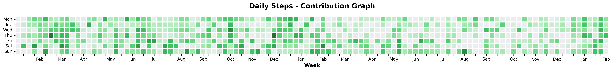
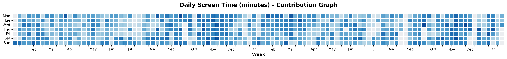
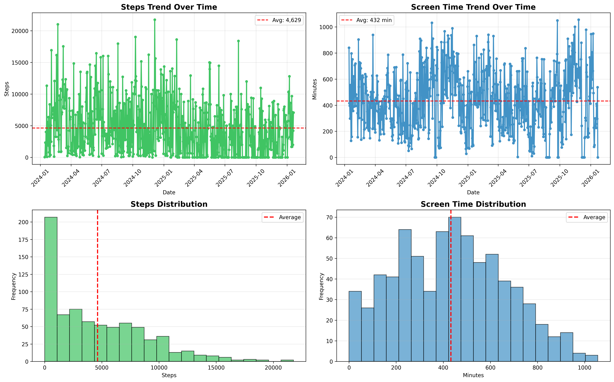
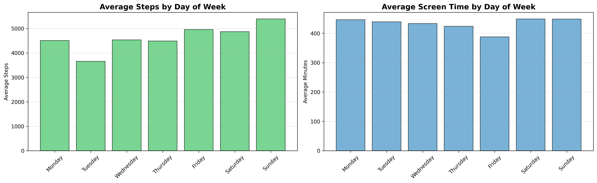

# Health Data Analysis Report

> 🤖 **Auto-generated** | Last updated: January 21, 2026 at 21:05 UTC

## Overview
This report analyzes your health and activity data from **14/01/2024 to 22/01/2026** (740 days).

---

## 📊 GitHub-Style Activity Graphs

### Daily Steps

### Daily Screen Time

---

## 📈 Key Statistics

### Steps Summary
- **Total Steps**: 3,416,071
- **Average Daily Steps**: 4,629
- **Maximum Steps (Single Day)**: 21,759
- **Minimum Steps (Single Day)**: 0
- **10,000+ Step Days**: 88 days (11.9%)

### Screen Time Summary
- **Total Screen Time**: 5333.3 hours (320,000 minutes)
- **Average Daily Screen Time**: 432 minutes (7.2 hours)
- **Maximum Screen Time (Single Day)**: 1056 minutes (17.6 hours)
- **Minimum Screen Time (Single Day)**: 0 minutes (0.0 hours)

---

## 📉 Detailed Analysis

### Trends and Distributions

### Day of Week Patterns

---

## 🔍 Insights

### Steps Insights
- **Most Active Day**: Sunday (avg: 5,389 steps)
- **Least Active Day**: Tuesday (avg: 3,656 steps)
- **Daily Goal Achievement**: You're 5,371 steps away from the recommended 10,000 daily steps. 💪

### Screen Time Insights
- **Highest Screen Time Day**: Saturday (avg: 449 minutes)
- **Lowest Screen Time Day**: Friday (avg: 388 minutes)
- **Weekly Screen Time**: Approximately 50.5 hours per week

### Correlation
- **Steps vs Screen Time Correlation**: -0.246
  - ➡️ Weak correlation between screen time and steps

---

## 💡 Recommendations

1. **Steps**: Try to increase daily steps gradually to reach 10,000. 🚶
2. **Screen Time**: Consider reducing screen time for better work-life balance. 📱
3. **Consistency**: Focus on maintaining regular activity patterns throughout the week.

---

## 📅 Weekly Breakdown

| Day of Week | Avg Steps | Avg Screen Time (min) |
|-------------|-----------|----------------------|
| Monday | 4,507 | 446 |
| Tuesday | 3,656 | 439 |
| Wednesday | 4,535 | 433 |
| Thursday | 4,489 | 424 |
| Friday | 4,957 | 388 |
| Saturday | 4,873 | 449 |
| Sunday | 5,389 | 448 |

---

## 🔄 How This Works

This README is automatically updated whenever you push changes to `data.csv`. The analysis pipeline:

1. 📥 Detects changes to data.csv
2. 🔬 Runs Python analysis script
3. 📊 Generates visualizations
4. 📝 Updates README with latest insights
5. 🚀 Commits and pushes changes

**To update**: Simply edit `data.csv` and push to the main branch!

---

*🤖 Auto-generated from data.csv using GitHub Actions*
